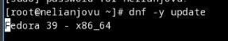
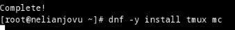
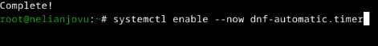

---
## Front matter
lang: ru-RU
title: Лабораторная работа No1
subtitle: Операционные системы
author:
  - Нджову Н.
institute:
  - Российский университет дружбы народов, Москва, Россия
date: 27 февраля 2024

## i18n babel
babel-lang: russian
babel-otherlangs: english

## Formatting pdf
toc: false
toc-title: Содержание
slide_level: 2
aspectratio: 169
section-titles: true
theme: metropolis
header-includes:
 - \metroset{progressbar=frametitle,sectionpage=progressbar,numbering=fraction}
 - '\makeatletter'
 - '\beamer@ignorenonframefalse'
 - '\makeatother'
---

## Цель работы

Целью данной работы является приобретение практических навыков установки операционной системы на виртуальную машину, настройки минимально необходимых для дальнейшей работы сервисов.

## Задание

1. Создание виртуальной машины

2. Установка операционной системы

3. Работа после установки

4. Установка программного обеспечения для создания документации

5. Допольнительные задания

##1. Создание виртуальной машины

Нажав 'создать', я создаю новую витуалную машину(рис.1)

{#fig:001 width=55%}

##1. Создание виртуальной машины

Я указываю обьем основной памяти витуальной машины размером 4096МБ(рис.2)

{#fig:001 width=55%}

##1. Создание виртуальной машины

Я выбираю создание нового витуального жесткого диска

Я установила конфигурацию жесткого диска: загрузочный VDI

Я устанавливаю размер диска равным 120 ГБ(рис.3)

{#fig:001 width=55%}

##1. Создание виртуальной машины

Я выбираю динамический виртуальный жесткий диск 
Я выбираю конфигурацию своей витуальной машины в VirtualBox. Я захожу в раздел 'Носители',добавляю новый оптический дискодов и выбираю загруженныйй образ операционной системы Fedora(рис.4)

{#fig:001 width=55%} 

##2. Установка операционной системы

Я запускаю созданую витуальную машину для установки

Я вижу интерфейс начальной конфигурации. Я нажимаю Enter, затем нажимаю Enter

Я нажмаю Win+Enter для запуска терминала. В терминала запускаю liveinst(рис.5)

{#fig:001 width=70%}

##2. Установка операционной системы

Я выбираю язык для использования в процессе установки- английский, потому что мне так удобнее(рис.6)

{#fig:001 width=55%}

##2. Установка операционной системы

Я проверяю место установки и сохраняю значение по умольчанию

Я установлю аккаунт администратора и создаю пароль для супер-пользователя

Я создаю пользователя, добавляю адмнистративные привилегии для этой учетной записи, чтобы я мог свободно выполнять команды как супер-пользователя

Далее устанавливается операционная система. После установки я нажимаю "завершить установку"

##2. Установка операционной системы

Диск не выключился автоматически, поэтому я захожу в настройки, чтобы отключить его(рис.7)

{#fig:001 width=55%}

##3. Работа после установки

Я запускаю виртуальную машину. Я вхожу в ОС под учетной записью, которую я установила во время установки(рис.8)

{#fig:001 width=55%}

##3. Работа после установки

Я запускаю Win+Enter, чтобы запустить терминал и переключиться на роль супер-пользователя(рис.9)

{#fig:001 width=70%}

##3. Работа после установки

Я обновляю все пакеты(рис.10)

{#fig:001 width=70%}

##3. Работа после установки

Я устанавливаю программы для удобства работы в консоли;tmux и mc(рис.11)

{#fig:001 width=70%}

##3. Работа после установки

Я устанавливаю программы для автоматического обновления(рис.12)

{#fig:001 width=70%}

##3. Работа после установки

Я запускаю таймер(рис.13)

{#fig:001 width=70%}

##3. Работа после установки

Я перехожу в каталог /etc/selnux, открываю md и ищу нужный мне файл

Я изменяю открытый файл; SELINUX = enforcing меняю на значение SELINUX = permissive(рис.14)

{#fig:001 width=70%}

Перезагружаю витуальную машину

##3. Работа после установки

Я снова вхожу в ОС, снова запускаю терминал и запускаю терминальный мультиплексор

Я переключаюсь на роль супер-пользователя

Я устанавливаю пакет dkms(рис.15)

{#fig:001 width=70%}

##3. Работа после установки

В меню витуальную машины я подключаю образ диска гостевой ОС и монтирую диск с помощью утилиты mount(рис.16)

{#fig:001 width=70%}

##3. Работа после установки

Я устанавливаю драйверов(рис.17)

{#fig:001 width=70%}

##3. Работа после установки

Перезагружаю витуальную машину

Я снова вхожу в ОС, снова запускаю терминал и запускаю терминальный мультиплексор

Я захожу в каталог /etc/X11/xorg.conf.d/00-keyboard.conf(рис.18)

{#fig:001 width=55%}

##3. Работа после установки

Я редактирую конфигурационный файл(рис.19)

{#fig:001 width=55%}

##3. Работа после установки

Перезагружаю витуальную машину

##4. Установка программного обеспечения для создания документации

Я запускаю терминал, запускаю терминальный мультиплексор tmux, переключаюсь на роль супер-пользователя. Потом я устанавливаю pandoc, испоьзуя команду dnf и флаг - y, который автоматически отвечает на все системные вопросы "да"(рис.20)

{#fig:001 width=70%}

##4. Установка программного обеспечения для создания документации

Я устанавливаю дистрибутив texlive(рис.21)

{#fig:001 width=70%}

## Выводы

Выполняя эту лабораторную работу, я приобрел практические навыки установки операционной системы на витуальную машину, а также произвел настройка минимальных сервисов, необходимых для дальнейшей работы

##5. Допольнительные задания#

Я вхожу команду dmesg | less в терминале, чтобы проанализировать последовательность загрузки системы(рис.22)

{#fig:001 width=70%}

##5. Допольнительные задания

Используя поиск, выполняемый командой "dmesg | grep -i", я ищу:

версия ядра Linux;6.7.4-200.fc39.x86_64(рис.23)

{#fig:001 width=70%}

##5. Допольнительные задания

Частота процессора (Detected Mhz processor);2494.336 MHz(рис.24).

{#fig:001 width=70%}

##5. Допольнительные задания

Модель процессора (CPU0)(рис.25).

{#fig:001 width=70%}

##5. Допольнительные задания

Объём доступной оперативной памяти (Memory available)(рис.26).

{#fig:001 width=70%}

##5. Допольнительные задания

Тип обнаруженного гипервизора (Hypervisor detected)(рис.27)

{#fig:001 width=70%}

##5. Допольнительные задания

Тип файловой системы корневого раздела можно проверить с помощью опции fdisk(рис.28)

{#fig:001 width=70%}

##5. Допольнительные задания

Последовательности монтирования файловых систем можно просмотреть, введя слово mount в поле поиска результата dmesg(рис.29)

{#fig:001 width=70%}

## Список литературы{.unnumbered}

::: {#refs}
1. Dash, P. Getting Started with Oracle VM VirtualBox / P. Dash. – Packt Publishing Ltd, 2013. – 86 сс.
2. Colvin, H. VirtualBox: An Ultimate Guide Book on Virtualization with VirtualBox. VirtualBox / H. Colvin. – CreateSpace Independent Publishing Platform, 2015. – 70 сс.
3. Vugt, S. van. Red Hat RHCSA/RHCE 7 cert guide : Red Hat Enterprise Linux 7 (EX200 and EX300) : Certification Guide. Red Hat RHCSA/RHCE 7 cert guide / S. van Vugt. – Pearson IT Certification, 2016. – 1008 сс.
4. Робачевский, А. Операционная система UNIX / А. Робачевский, С. Немнюгин, О. Стесик. – 2-е изд. – Санкт-Петербург : БХВ-Петербург, 2010. – 656 сс.
5. Немет, Э. Unix и Linux: руководство системного администратора. Unix и Linux / Э. Немет, Г. Снайдер, Т.Р. Хейн, Б. Уэйли. – 4-е изд. – Вильямс, 2014. – 1312 сс.
6. Колисниченко, Д.Н. Самоучитель системного администратора Linux : Системный администратор / Д.Н. Колисниченко. – Санкт-Петербург : БХВ-Петербург, 2011. – 544 сс.
7. Robbins, A. Bash Pocket Reference / A. Robbins. – O’Reilly Media, 2016. – 156 сс.

:::

