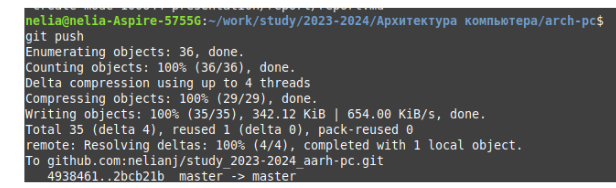
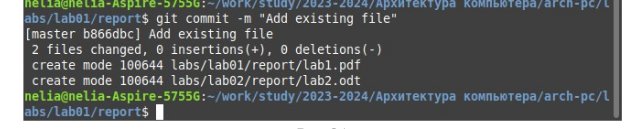

---
## Front matter
title: "Отчет по лабораторной работе No.2"
subtitle: "Дисциплины: Архитектура компьютера"
author: "Нджову Нелиа"

## Generic otions
lang: ru-RU
toc-title: "Содержание"

## Bibliography
bibliography: bib/cite.bib
csl: pandoc/csl/gost-r-7-0-5-2008-numeric.csl

## Pdf output format
toc: true # Table of contents
toc-depth: 2
lof: true # List of figures
lot: true # List of tables
fontsize: 12pt
linestretch: 1.5
papersize: a4
documentclass: scrreprt
## I18n polyglossia
polyglossia-lang:
  name: russian
  options:
	- spelling=modern
	- babelshorthands=true
polyglossia-otherlangs:
  name: english
## I18n babel
babel-lang: russian
babel-otherlangs: english
## Fonts
mainfont: PT Serif
romanfont: PT Serif
sansfont: PT Sans
monofont: PT Mono
mainfontoptions: Ligatures=TeX
romanfontoptions: Ligatures=TeX
sansfontoptions: Ligatures=TeX,Scale=MatchLowercase
monofontoptions: Scale=MatchLowercase,Scale=0.9
## Biblatex
biblatex: true
biblio-style: "gost-numeric"
biblatexoptions:
  - parentracker=true
  - backend=biber
  - hyperref=auto
  - language=auto
  - autolang=other*
  - citestyle=gost-numeric
## Pandoc-crossref LaTeX customization
figureTitle: "Рис."
tableTitle: "Таблица"
listingTitle: "Листинг"
lofTitle: "Список иллюстраций"
lotTitle: "Список таблиц"
lolTitle: "Листинги"
## Misc options
indent: true
header-includes:
  - \usepackage{indentfirst}
  - \usepackage{float} # keep figures where there are in the text
  - \floatplacement{figure}{H} # keep figures where there are in the text
---

# Цель работы

Целью работы является изучить идеологию и применение средств
контроля версий. При-обрести практические навыки по работе с системой
git.

# Задание

1. Настройка GitHub.
2. Базовая настройка Git.
3. Создание SSH-ключа.
4. Создание рабочего пространства и репозитория курса на основе шаблона.
5. Создание репозитория курса на основе шаблона.
6. Настройка каталога курса.
7. Выполнение заданий для самостоятельной работы.

# Выполнение лабораторной работы

1. Настройка GitHub.
Я создам учетную запись на сайте GitHub(рис 1).

{#fig:001 width=70%}

2.Базовая настройка Git.
Я открою терминал и я использую предварительную конфигурацию git,запущу команду git config --global user.name "<имя пользователя>" и команду git config --global user.email "<work@mail>", четко указав свое имя пользователя и адрес электронной почты пользователя(рис 2).

{#fig:001 width=70%}

Я настрою utf-8 в выводе сообщений git для корректного отображения символов(рис 3).

{#fig:001 width=70%}

Я назову начальную ветку 'master'(рис 4).

{#fig:001 width=70%}

Я задаю параметр autocrlf со значением input,Задаю параметр autocrlf со значением input(рис 5).

{#fig:001 width=70%}

Я задаю параметр safecrlf со значением warn, так Git будет проверять преобразование на обратимость (рис 6).

{#fig:001 width=70%}

3.Создание SSH-ключа.
Чтобы впоследствии идентифицировать пользователя в репозитории, я сгенерирую ряд ключей с помощью команд;ssh-keygen -C “Имя Фамилия, work@email”, указывая имя владельцаи электронную почту владельца (рис 7).

{#fig:001 width=70%}

Xclip — это утилита, которая позволяет копировать любой текст через терминал. Для его установки я буду использовать команду apt-get install с ключом -y(рис 8).

{#fig:001 width=70%}

Я скопирую ключ из каталога, в котором он был сохранен, с помощью xclip(рис 9).

{#fig:001 width=70%}

Теперь я открою свою учетную запись github и перейду в свой профиль, там я выберу ключи "SSH и GPG" и выберу "New SSH key"(рис 10).

{#fig:001 width=70%}

Вставляю скопированный ключ в поле "Key". В поле Title указываю имя для ключа. Нажимаю "Add SSH-key", чтобы завершить добавление ключа(рис 11).

{#fig:001 width=70%}

4.Создание рабочего пространства и репозитория курса на основе шаблона.
Я Создаю директорию, рабочее пространство, с помощью утилиты mkdir.С помощью ключу -p создаю все директории после домашней ~/work/study/2023-2024/“Архитектура компьютера” рекурсивно.Я проверяю с помощью ls, файлы действительно ли были созданы (рис 12).

{#fig:001 width=70%}

5.Создание репозитория курса на основе шаблона.
В браузере перехожу на страницу репозитория с шаблоном курса по адресу https://github.com/yamadharma/course-directory-student-template.Далее выбираю «Use this template», чтобы использовать этот шаблон для своего репозитория(рис 13).

{#fig:001 width=70%}

В открывшемся окне задаю имя репозитория (Repository name):study_2023–2024_arh-pc и создаю репозиторий, нажимаю на кнопку «Create repository from template»(рис 14).

{#fig:001 width=70%}

Репозиторий создан(рис 15).

{#fig:001 width=70%}

Через терминал перехожу в созданный каталог курса с помощью утилиты cd(рис 16).

{#fig:001 width=70%}

Я клонирую созданный репозиторий с помощью команды git clone --recursive git@github.com:/study_2023-2024_arh-pc.git arch-pc (рис 17).

{#fig:001 width=70%}

Я открою созданный мной репозиторий и скопирую ссылку для клонирования, которую я найду в 'code' опции, нажав ‘SSH’(рис 18).

{#fig:001 width=70%}

6.Настройка каталога курса
Я перехожу в каталог arch-pc, используя команду cd(рис 19).

{#fig:001 width=70%}

Я удаляю лишние файлы с помощью команду rm(рис 20).

{#fig:001 width=70%}

Я создаю необходимые каталоги (рис 21).

{#fig:001 width=70%}

Я отправлю созданные мной каталоги из локального репозитория на сервер: я сделаю это с помощью git add, затем прокомментирую и сохраню изменения на сервере, например добавление курса, с помощью git commit(рис 22). Я отправляю все на сервер с помощью git push(рис 23).

{#fig:001 width=70%}

{#fig:001 width=70%}

Я проверяю правильность выполнения работы сначала на самом сайте GitHub(рис 24).

{#fig:001 width=70%}

7.Выполнение заданий для самостоятельной работы.
1.Я перехожу в директорию labs/lab03/report с помощью команду cd.Создаю каталоге файл для отчета по третьей лабораторной работе с помощью команду touch(рис 25).

{#fig:001 width=70%}

Я открою в нем текстовый процессор, открою созданный мной файл и поработаю над отчетом(рис 26).

{#fig:001 width=70%}

2.Я перейду из подкаталога lab03/report в lab01/report с помощью команды cd ..(рис 27).

{#fig:001 width=70%}

А затем скопирую свой первый лабораторный отчет в подкаталог lab01/report (рис 28).

{#fig:001 width=70%}

Я сделаю то же самое для лаборатории 2(рис 29) и (рис 30).

{#fig:001 width=70%}

{#fig:001 width=70%}

3.. Я добавляю с помощью команды git add в коммит созданные файлы(рис 31).

{#fig:001 width=70%}

Я сохраню изменения на сервере командой git commit -m «...», пояснив,что файлы я добавил(рис 32).

{#fig:001 width=70%}

Я отправляю в центральный репозиторий сохраненные изменения командой git push -f origin master(рис 33).

{#fig:001 width=70%}

Я подтверждаю правильность выполнения задач, проверив свою учетную запись на github(рис 34).

{#fig:001 width=70%}

Я также проверю, добавились ли файлы с отчетами.

{#fig:001 width=70%}

{#fig:001 width=70%}

# Выводы

При выполнении данной лабораторной работы я изучила идеологию и применение средств контроля версий, а также приобрела практические навыки по работе с системой git.

# Список литературы{.unnumbered}
Архитектура ЭВМ
glebradchenko
Git - gitattributes Документация
