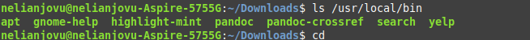
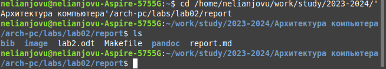

---
## Front matter
title: "Отчет по лабораторной работе No.3"
subtitle: "Дисциплины: Архитектура компьютера"
author: "Нджову Нелиа"

## Generic otions
lang: ru-RU
toc-title: "Содержание"

## Bibliography
bibliography: bib/cite.bib
csl: pandoc/csl/gost-r-7-0-5-2008-numeric.csl

## Pdf output format
toc: true # Table of contents
toc-depth: 2
lof: true # List of figures
lot: true # List of tables
fontsize: 12pt
linestretch: 1.5
papersize: a4
documentclass: scrreprt
## I18n polyglossia
polyglossia-lang:
  name: russian
  options:
	- spelling=modern
	- babelshorthands=true
polyglossia-otherlangs:
  name: english
## I18n babel
babel-lang: russian
babel-otherlangs: english
## Fonts
mainfont: PT Serif
romanfont: PT Serif
sansfont: PT Sans
monofont: PT Mono
mainfontoptions: Ligatures=TeX
romanfontoptions: Ligatures=TeX
sansfontoptions: Ligatures=TeX,Scale=MatchLowercase
monofontoptions: Scale=MatchLowercase,Scale=0.9
## Biblatex
biblatex: true
biblio-style: "gost-numeric"
biblatexoptions:
  - parentracker=true
  - backend=biber
  - hyperref=auto
  - language=auto
  - autolang=other*
  - citestyle=gost-numeric
## Pandoc-crossref LaTeX customization
figureTitle: "Рис."
tableTitle: "Таблица"
listingTitle: "Листинг"
lofTitle: "Список иллюстраций"
lotTitle: "Список таблиц"
lolTitle: "Листинги"
## Misc options
indent: true
header-includes:
  - \usepackage{indentfirst}
  - \usepackage{float} # keep figures where there are in the text
  - \floatplacement{figure}{H} # keep figures where there are in the text
---

# Цель работы

Целью данной лабораторной работы является освоение процедуры оформления отчетов с помощью легковесного языка разметки Markdown.

# Задание

1. Установка необходимого ПО

2. Заполнение отчета по выполнению лабораторной работы No4 с помощью языка разметки Markdown

3. Задание для самостоятельной работы

# Выполнение лабораторной работы

1. Установление необходимого ПО
Я скачал TexLive с официального сайта. Распаковка архива(рис 1).

{#fig:001 width=70%}

В распакованную папку я перейду с помощью команды cd. Я запускаю сценарий install-tl-* от имени пользователя root, используя sudo в начале команды(рис 2).

{#fig:001 width=70%}

Я добавляю /usr/local/texlive/2022/bin/x86_64-linux в свой PATH для текущих и будущих сеансов(рис 3).

{#fig:001 width=70%}

1.2 Установка pandoc и pandoc-crossref.
Сейчас скачаю архив версии pandoc(рис 4).

{#fig:001 width=70%}

Я скачаю архив pandoc-crossref 0.3.13.0(рис 5).

{#fig:001 width=70%}

Я распакую скачанные архивы(рис 6).

{#fig:001 width=70%}

Я скопирую файлы pandoc и pandoc Crossref в каталог /usr/local/bin/ с помощью команды cp и используя sudo от имени пользователя root(рис 7).

{#fig:001 width=70%}

Я проверяю корректность выполненных действий(рис 8).

{#fig:001 width=70%}

2. Заполнение отчета по выполнению лабораторной работы No.3 с помощью языка разметки Markdown.
I open the terminal. I go to the course catalog created during the previous laboratory work(рис 9).

{#fig:001 width=70%}

Я обновляю локальный репозиторий, скачав изменения из удаленного репозитория с помощью команды git pull(рис 10).

{#fig:001 width=70%}

Я перейду в каталог с отчётом No.3 с помощью команду cd(рис 11).

{#fig:001 width=70%}

Я компилирую шаблон с использованием Makefile, вводя команду make(рис 12).

{#fig:001 width=70%}

Я открываю сгенерированные файлы report.docx LibreOffice и report pdf(рис 13 и 14).

{#fig:001 width=70%}

{#fig:001 width=70%}

Полученные файлы я удалю с помощью Makefile, введя команду make clean. Командой ls проверяю, удалены ли созданные файлы(рис 15).

{#fig:001 width=70%}

Я открываю файл report.md с помощью любого текстового редактор(рис 16).

{#fig:001 width=70%}

Я хочу, чтобы у меня на всякий случай сохранился шаблон отчета, поэтому копирую файл с новым названием с помощью команду cp(рис 17).

{#fig:001 width=70%}

Я начинаю заполнять отчет с помощью языка разметки Markdown в скопированном файле(рис 18).

{#fig:001 width=70%}

Задание для самостоятельной работы
Я перейду в каталог lab02/report с помощью команды cd(рис 19).

{#fig:001 width=70%}

Я изменю имя с report.md на lab2.Nelia.report.md с помощью команды cp и запущу команду make(рис 20 и 21).

{#fig:001 width=70%}

{#fig:001 width=70%}

Я открываю файл с помощью текстового редактора и начинаю заполнять отчет(рис 22).

{#fig:001 width=70%}

Я компилирую файл с отчетом по лабораторной работе(рис 23)

{#fig:001 width=70%}

Я удаляю сгенерированные фаилы report.docx и report.pdf(рис 24)

{#fig:001 width=70%}

Я добавляю изменения на GitHub с помощью комнадой git add и сохраняю изменения с помощью commit(рис 25)

{#fig:001 width=70%}

Я отправлялю файлы на сервер с помощью команды git pull(рис 26)

{#fig:001 width=70%}

# Выводы

В результате выполнения данной лабораторной работы я освоила процедуры оформления отчетов с помощью легковесного языка разметки Markdown.

# Список литературы{.unnumbered}

Архитектура ЭВМ
