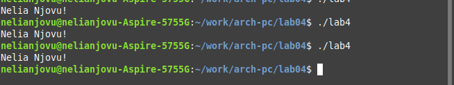

---
## Front matter
title: "Отчет по лабораторной работе No.4"
subtitle: "Дисциплины: Архитектура компьютера"
author: "Нджову Нелиа"

## Generic otions
lang: ru-RU
toc-title: "Содержание"

## Bibliography
bibliography: bib/cite.bib
csl: pandoc/csl/gost-r-7-0-5-2008-numeric.csl

## Pdf output format
toc: true # Table of contents
toc-depth: 2
lof: true # List of figures
lot: true # List of tables
fontsize: 12pt
linestretch: 1.5
papersize: a4
documentclass: scrreprt
## I18n polyglossia
polyglossia-lang:
  name: russian
  options:
	- spelling=modern
	- babelshorthands=true
polyglossia-otherlangs:
  name: english
## I18n babel
babel-lang: russian
babel-otherlangs: english
## Fonts
mainfont: PT Serif
romanfont: PT Serif
sansfont: PT Sans
monofont: PT Mono
mainfontoptions: Ligatures=TeX
romanfontoptions: Ligatures=TeX
sansfontoptions: Ligatures=TeX,Scale=MatchLowercase
monofontoptions: Scale=MatchLowercase,Scale=0.9
## Biblatex
biblatex: true
biblio-style: "gost-numeric"
biblatexoptions:
  - parentracker=true
  - backend=biber
  - hyperref=auto
  - language=auto
  - autolang=other*
  - citestyle=gost-numeric
## Pandoc-crossref LaTeX customization
figureTitle: "Рис."
tableTitle: "Таблица"
listingTitle: "Листинг"
lofTitle: "Список иллюстраций"
lotTitle: "Список таблиц"
lolTitle: "Листинги"
## Misc options
indent: true
header-includes:
  - \usepackage{indentfirst}
  - \usepackage{float} # keep figures where there are in the text
  - \floatplacement{figure}{H} # keep figures where there are in the text
---

# Цель работы

Целью данной работы является освоение процедуры компиляции и ассемблирования программ, написанных на ассемблере NASM.

# Задание

1. Создание программы Hello world!

2. Работа с транслятором NASM

3. Работа с расширенным синтаксисом командной строки NASM

4. Работа с компоновщиком LD

5. Запуск исполняемого файла

6. Выполнение заданий для самостоятельной работы.

# Выполнение лабораторной работы

1 Создание программы Hello world!

я буду использовать mkdir для создания указанного каталога, а затем с помощью команды cd войду в каталог, в котором буду работать, там я создам пустой текстовый файл «hello.asm» с помощью команды touch(рис 1).

{#fig:001 width=70%}

Я открываю созданный файл в текстовом редакторе(рис 2)

{#fig:001 width=70%}

Я заполню файл, вставив в него программу вывода «Hello word!»(рис 3)

{#fig:001 width=70%}

2 Транслятором NASM

Я преобразую текст программы в вывод «Hello world!» в объектный код с помощью транслятора NASM с помощью команды nasm -f elf hello.asm. Далее проверяю правильность выполнения команды с помощью команды ls и, как показано, файл hello.o создан(рис 4)

{#fig:001 width=70%}

3 Расширенным синтаксисом командной строки NASM

Я введу команду, которая скомпилирует файл hello.asm в файл obj.o, и файл будет содержать символы отладки (переключатель -g), также используя переключатель -l будет создан файл листинга list.lst. Далее проверяю с помощью команды ls правильность выполнения команды(рис 5).

{#fig:001 width=70%}

4 Компоновщиком LD

Я передам объектный файл hello.o для обработки компоновщиком LD для создания исполняемого файла hello. Далее я использую команду ls, чтобы проверить правильность выполнения команды(рис 6).

{#fig:001 width=70%}

Теперь я создам файл с именем «main» с помощью данной команды.Объектный файл, из которого собран этот исполняемый файл, имеет имя obj.o(рис 7)

{#fig:001 width=70%}

5 Запуск исполняемого файла

Я запущу созданный исполняемый файл hello(рис 8)

{#fig:001 width=70%}

6 Выполнение заданий для самостоятельной работы.

С помощью команды cp я создам копию файла hello.asm в текущем каталоге с именем lab4.asm(рис 9).

{#fig:001 width=70%}

C помощью текстового редактора я открою файл lab4.asm и внесу изменения в программу, чтобы она отображала мое имя и фамилию(рис 10)

{#fig:001 width=70%}

Текст программы я скомпилирую в объектный файл. С помощью команды ls я проверяю, что файл lab5.o создан(рис 11)

{#fig:001 width=70%}

Я передам объектный файл lab5.o компоновщику LD для обработки для создания исполняемого файла lab5(рис 12).

{#fig:001 width=70%}

Когда я запускаю исполняемый файл lab4, мое имя и фамилия фактически отображаются на экране(рис 13)

{#fig:001 width=70%}

Я скопирую файлы hello.asm и lab4.asm в свой локальный репозиторий в каталоге ~/work/study/2023-2024/"Архитектура компьютера"/arch-pc/labs/lab04/report. Я сделаю это с помощью команды cd(рис 14)

{#fig:001 width=70%}

Используя команду git add и git commit, я добавлю файлы в github(рис 15)

{#fig:001 width=70%}

Я отправляю файлы на сервер с помощью команды git push(рис 16)

{#fig:001 width=70%}

# Выводы

При выполнении данной лабораторной работы я освоила процедуры компиляции и сборки программ, написанных на ассемблере NASM.

# Список литературы{.unnumbered}

Архитектура ЭВМ
