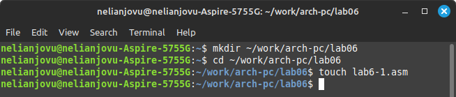
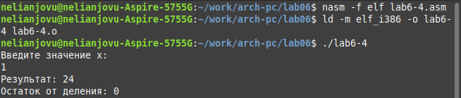
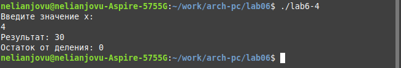

---
## Front matter
title: "Отчет по лабораторной работе No.6"
subtitle: "Дисциплины: Архитектура компьютера"
author: "Нджову Нелиа"

## Generic otions
lang: ru-RU
toc-title: "Содержание"

## Bibliography
bibliography: bib/cite.bib
csl: pandoc/csl/gost-r-7-0-5-2008-numeric.csl

## Pdf output format
toc: true # Table of contents
toc-depth: 2
lof: true # List of figures
lot: true # List of tables
fontsize: 12pt
linestretch: 1.5
papersize: a4
documentclass: scrreprt
## I18n polyglossia
polyglossia-lang:
  name: russian
  options:
	- spelling=modern
	- babelshorthands=true
polyglossia-otherlangs:
  name: english
## I18n babel
babel-lang: russian
babel-otherlangs: english
## Fonts
mainfont: PT Serif
romanfont: PT Serif
sansfont: PT Sans
monofont: PT Mono
mainfontoptions: Ligatures=TeX
romanfontoptions: Ligatures=TeX
sansfontoptions: Ligatures=TeX,Scale=MatchLowercase
monofontoptions: Scale=MatchLowercase,Scale=0.9
## Biblatex
biblatex: true
biblio-style: "gost-numeric"
biblatexoptions:
  - parentracker=true
  - backend=biber
  - hyperref=auto
  - language=auto
  - autolang=other*
  - citestyle=gost-numeric
## Pandoc-crossref LaTeX customization
figureTitle: "Рис."
tableTitle: "Таблица"
listingTitle: "Листинг"
lofTitle: "Список иллюстраций"
lotTitle: "Список таблиц"
lolTitle: "Листинги"
## Misc options
indent: true
header-includes:
  - \usepackage{indentfirst}
  - \usepackage{float} # keep figures where there are in the text
  - \floatplacement{figure}{H} # keep figures where there are in the text
---

# Цель работы

Целью данной работы является освоение арифметических инструкций на языке ассемблера NASM.

# Задание

1. Символьные и численные данные в NASM

2. Выполнение арифметических операций в NASM

3. Выполнение заданий для самостоятельной работы


# Выполнение лабораторной работы

**1. Символьные и численные данные в NASM**

Я создам каталог для программ лабораторных работ 6 с помощью команды mkdir, зайду в него с помощью команды cd и создам файл lab6-1.asm с помощью команды touch(рис 1)

{#fig:001 width=70%}

Я скопирую файл in_out.asm в текущий каталог с помощью команды cp, потому что буду использовать его в программах(рис 2)

{#fig:001 width=70%}

Открою созданный файл lab6-1.asm и скопирую в него программу вывода значения регистра eax(рис 3)

{#fig:001 width=70%}

Я создам исполняемый файл программы и запущу его. Программа выведет символ j, поскольку программа выводит символ, соответствующий сумме ASCII двоичных кодов символов 4 и 6(рис 4)

{#fig:001 width=70%}

Я заменю символы '6' и '4' в тексте программы на цифры 6 и 4(рис 5)

{#fig:001 width=70%}

Я создам новый исполняемый файл программы и запущу его. Теперь отображается символ с кодом 10, это символ перевода строки(рис 6)

{#fig:001 width=70%}

Я создам новый файл lab6-2.asm в каталоге ~/work/arch-pc/lab06 с помощью команды touch(рис 7) 

{#fig:001 width=70%}

Я открою вновь созданный файл и скопирую в него заданный текст программы(рис 8)

{#fig:001 width=70%}

Я создаю и запускаю исполняемый файл lab6-2. Теперь на выходе будет число 106, поскольку функция iprintLF позволяет программе выводить точное число вместо символа ASCII(рис 9)

{#fig:001 width=70%}

Теперь я заменю символы '6' и '4' в тексте программы на цифры 6 и 4(рис 10)

{#fig:001 width=70%}

Как и ранее, я создаю и запускаю исполняемый файл lab6-2. Вывод равен 10, поскольку функция iprintLF позволяет программе выводить точное число вместо символа ASCII(рис 11)

{#fig:001 width=70%}

**2. Выполнение арифметических операций в NASM**

Я создам еще один файл lab6-3.asm в каталоге ~/work/arch-pc/lab06 с помощью команды touch(рис 12)

{#fig:001 width=70%}

В созданный файл ввожу текст программы для вычисления значения выражения f(x) = (5 * 2 + 3)/3(рис 13)

{#fig:001 width=70%}

Создаю исполняемый файл и запускаю его(рис 14)

{#fig:001 width=70%}

Я изменю программу так, чтобы она вычисляла значение выражения f(x) = (4 *6 + 2)/5(рис 15)

{#fig:001 width=70%}

Теперь я создаю исполняемый файл и запускаю его(рис 16)

{#fig:001 width=70%}

Я создам файл variant.asm в каталоге ~/work/arch-pc/lab06 с помощью команду touch(рис 17)

{#fig:001 width=70%}

Скопирую текст программы в файл для расчета варианта задания по студенческому билету(рис 18)

{#fig:001 width=70%}

Я создам и запущу исполняемый файл. Ввожу с клавиатуры номер студенческого билета, программа показывает, что мой вариант-14(рис 19)

{#fig:001 width=70%}

**2.1 Ответы на вопросы по программе**

1.mov eax,rem

 call sprint

2.mov ecx,x — используется для помещения адреса входной строки x в регистр ecx.

mov edx,80 — записывает длину входной строки в регистр edx

call sread — вызов подпрограммы из внешнего файла, позволяющей ввести сообщение с клавиатуры

3.call atoi используется для преобразования ascii-кода символа в целое число и записи результата в регистр eax

4.xor edx,edx

mov ebx,20

div ebx

inc edx

5.Остаток от деления записывается в регистр edx

6.Инструкция inc edx увеличивает значение регистра edx на 1

7.mov eax,edx

 call iprintLF

**3. Выполнение заданий для самостоятельной работы**

Я создам файл lab6-4.asm с помощью команды touch(рис 20)

{#fig:001 width=70%}

Созданный файл открою для редактирования, введу в него текст программы для вычисления значения выражения (8*х-6)/2 (рис. 4.24). Это выражение было под вариантом 12(рис 21)

{#fig:001 width=70%}

Я создам и запущу исполняемый файл. Когда вы вводите значение 1, выход 1(рис 22)

{#fig:001 width=70%}

Я запускаю исполняемый файл еще раз, чтобы проверить работу программы с другим входным значением, на этот раз я буду использовать 5, а на выходе должно быть 17. Программа работала корректно(рис 23)

{#fig:001 width=70%}

***Листинг 3.1. Программа для вычисления значения выражения (8*x - 6)/2***

```
%include 'in_out.asm'
SECTION .data
msg: DB 'Введите значение х: ',0
div: DB 'результат: ',0
rem: DB 'Остаток от деления: ',0
SECTION .bss
x: RESB 80
SECTION .text
GLOBAL _start
_start:
mov eax, msg
call sprintLF
mov ecx, x
mov edx, 80
call sread
mov eax,x ; EAX=x
call atoi
mov ebx,8 ; EBX=8
mul ebx ; EAX=EAX*EBX
add eax,-6 ; EAX=EAX+(-6)
xor edx,edx ; обнуляем EDX для корректной работы div
mov ebx,2 ; EBX=2
div ebx ; EAX=EAX/2, EDX=остаток от деления
mov edi,eax ; запись результата вычисления в 'edi'
mov eax,div ; вызов подпрограммы печати
call sprint ; сообщения 'Результат: '
mov eax,edi ; вызов подпрограммы печати значения
call iprintLF ; из 'edi' в виде символов
mov eax,rem ; вызов подпрограммы печати
call sprint ; сообщения 'Остаток от деления: '
mov eax,edx ; вызов подпрограммы печати значения
call iprintLF ; из 'edx' (остаток) в виде символов
call quit ; вызов подпрограммы завершения

```


# Выводы

При выполнении данной лабораторной работы я освоила арифметические инструкции языка ассемблера NASM.

# Список литературы{.unnumbered}

1. Архитектура ЭВМ

2. Таблица ASCII
