---
## Front matter
title: "Отчет по лабораторной работе No.7"
subtitle: "Дисциплины: Архитектура компьютера"
author: "Нджову Нелиа"

## Generic otions
lang: ru-RU
toc-title: "Содержание"

## Bibliography
bibliography: bib/cite.bib
csl: pandoc/csl/gost-r-7-0-5-2008-numeric.csl

## Pdf output format
toc: true # Table of contents
toc-depth: 2
lof: true # List of figures
lot: true # List of tables
fontsize: 12pt
linestretch: 1.5
papersize: a4
documentclass: scrreprt
## I18n polyglossia
polyglossia-lang:
  name: russian
  options:
	- spelling=modern
	- babelshorthands=true
polyglossia-otherlangs:
  name: english
## I18n babel
babel-lang: russian
babel-otherlangs: english
## Fonts
mainfont: PT Serif
romanfont: PT Serif
sansfont: PT Sans
monofont: PT Mono
mainfontoptions: Ligatures=TeX
romanfontoptions: Ligatures=TeX
sansfontoptions: Ligatures=TeX,Scale=MatchLowercase
monofontoptions: Scale=MatchLowercase,Scale=0.9
## Biblatex
biblatex: true
biblio-style: "gost-numeric"
biblatexoptions:
  - parentracker=true
  - backend=biber
  - hyperref=auto
  - language=auto
  - autolang=other*
  - citestyle=gost-numeric
## Pandoc-crossref LaTeX customization
figureTitle: "Рис."
tableTitle: "Таблица"
listingTitle: "Листинг"
lofTitle: "Список иллюстраций"
lotTitle: "Список таблиц"
lolTitle: "Листинги"
## Misc options
indent: true
header-includes:
  - \usepackage{indentfirst}
  - \usepackage{float} # keep figures where there are in the text
  - \floatplacement{figure}{H} # keep figures where there are in the text
---

# Цель работы

Целью данной лабораторной работы является изучение команд условного и безусловного перехода. Также приобрести навыки написания программ с использованием переходов и понимания назначения и структуры листинга файлов.

# Задание

1. Реализация переходов в NASM

2. Изучение структуры файлы листинга

3. Выполнение заданий для самостоятельной работы


# Выполнение лабораторной работы

**1. Реализация переходов в NASM**

Я создам каталог для программ лабораторных работ 7 под названием lab07 в каталоге ~/work/arch-pc с помощью команды mkdir(рис 1)

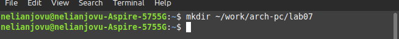{#fig:001 width=70%}

В созданном каталоге я создам файл с именем lab7-1.asm с помощью сенсорной команды(рис 2).

{#fig:001 width=70%}

Я скопирую файл in_out.asm в текущий каталог с помощью команды cp, потому что буду использовать его в программах(рис 3)

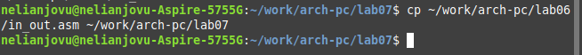{#fig:001 width=70%}

Я открою и введу заданный текст программы в созданный мною файл. Программа использует инструкцию jmp. Инструкция jmp в NASM используется для реализации безусловных переходов(рис 4)

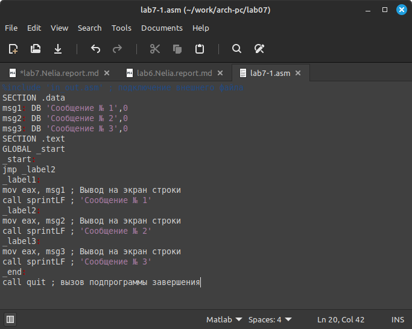{#fig:001 width=70%}

Я создам исполняемый файл и запущу его(рис 5).Как мы видим, использование инструкции jmp _label2 меняет порядок выполнения инструкций и позволяет выполнять инструкции, начиная с метки _label2, пропуская вывод первого сообщения.

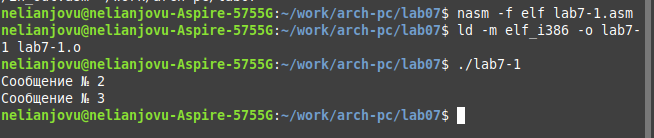{#fig:001 width=70%}

Инструкция jmp позволяет прыгать не только вперед, но и назад.Я изменю программу, добавив «jmp _label1» после label2 и «jmp _end» после label1, чтобы она сначала отображала «Сообщение 2», затем «Сообщение 1» и завершала работу без отображения «Сообщения 3».(рис 6)

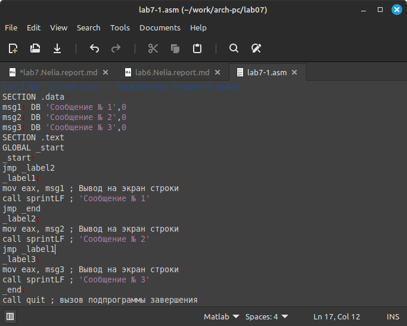{#fig:001 width=70%}

Я создам исполняемый файл, запущу его и проверю, работает ли программа корректно(рис 7)

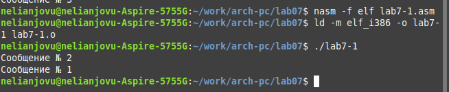{#fig:001 width=70%}

Теперь я изменю программу, добавив «jmp_label3» перед label1, «jmp_label1» после label2, «jmp_label2» после label3 и «jmp_end» после label1, чтобы она сначала отображала «Сообщение 3», затем «Сообщение 2» и, наконец, «Сообщение 1»(рис 8)

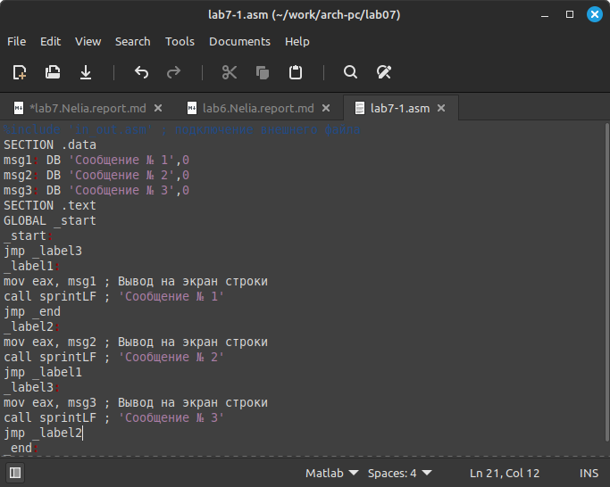{#fig:001 width=70%}

Я создам исполняемый файл, запущу его и проверю, работает ли программа корректно(рис 9)

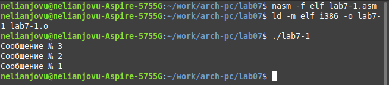{#fig:001 width=70%}

Я создам новый файл с именем lab7-2.asm в каталоге ~/work/arch-pc/lab07(рис 10)

{#fig:001 width=70%}

Я скопирую данную текстовую программу в только что созданный файл.При написании программ необходимо использовать условные переходы, т.е. переход должен происходить при выполнении какого-либо условия. Данная программа определяет и отображает наибольшую из 3-х целочисленных переменных: A, B и C. Значения A и C указаны в программе, значение B вводится с клавиатуры(рис 11)

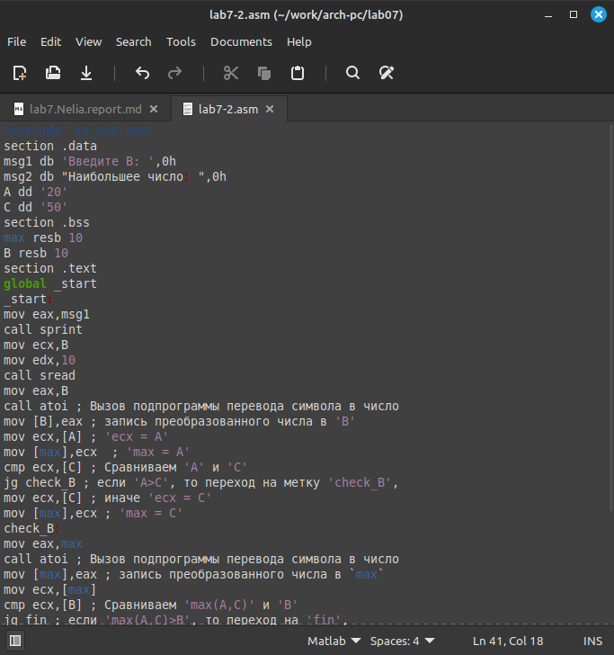{#fig:001 width=70%}

Я создам исполняемый файл и протестирую его на разных значениях B

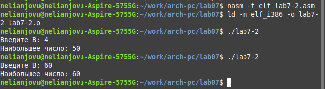{#fig:001 width=70%}

**2. Изучение структуры файлы листинга**

Указав ключ -l и имя файла листинга в командной строке. Файл листинга программы я создам из файла lab7-2.asm(рис 13)

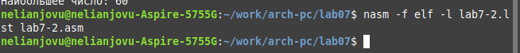{#fig:001 width=70%}

Теперь я открою файл листинга lab7-2.lst с помощью текстового редактора(рис 14)

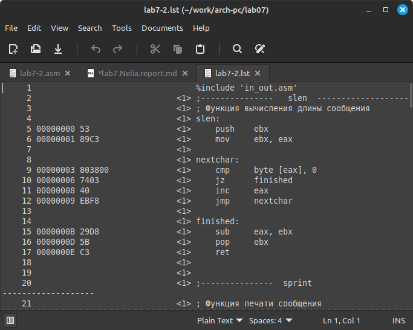{#fig:001 width=70%}

*строка 19 «вызов atoi» меняет B с арифметического символа на число*

*строка 174 «msg2 db "Наибольшее число: ",0h» отображает текст «Наибольшее число:» на экране*

*строка 173  «msg1 db 'Введите B: ',0h» отображает текст «Введите B:» на экране*

Я открою файл lab7-2.asm и удалю один из операндов, затем выполню широковещательную рассылку, чтобы получить файл листинга(рис 15 и 16)

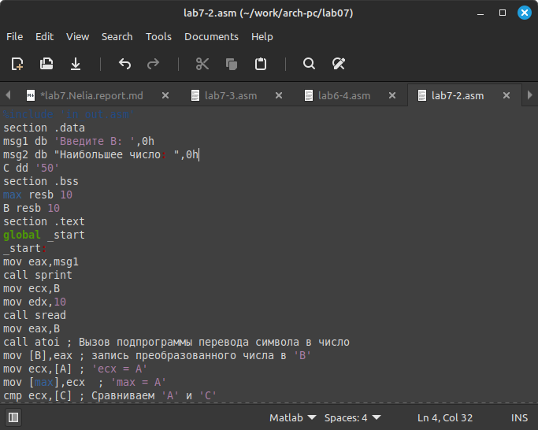{#fig:001 width=70%}

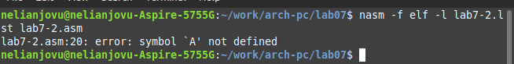{#fig:001 width=70%}

*При создании файла листинга выдала ошибку, так как в файле lab7-2.asm программа неверна*


**3. Выполнение заданий для самостоятельной работы**

С помощью touch команды я создам новый файл lab7-3.asm(рис 17)

{#fig:001 width=70%}

В созданном мной файле я напишу программу, которая будет находить минимальное значение среди трех чисел a, b и c. Я получу значения a, b и c из варианта, который я получил при выполнении лабораторной работы 6(рис 18)

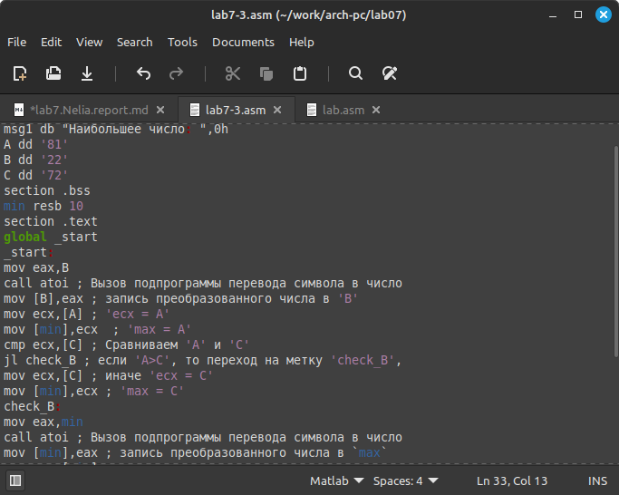{#fig:001 width=70%}
 
Теперь я создам исполняемый файл и запущу его, чтобы посмотреть, даст ли он правильный ответ(рис 19)

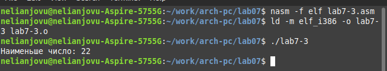{#fig:001 width=70%}

```
%include 'in_out.asm'
section .data
msg1 db "Наименьше число: ",0h
A dd '81'
B dd '22'
C dd '72'
section .bss
min resb 10
section .text
global _start
_start:
mov eax,B
call atoi ; Вызов подпрограммы перевода символа в число
mov [B],eax ; запись преобразованного числа в 'B'
mov ecx,[A] ; 'ecx = A'
mov [min],ecx  ; 'max = A'
cmp ecx,[C] ; Сравниваем 'A' и 'С'
jl check_B ; если 'A<C', то переход на метку 'check_B',
mov ecx,[C] ; иначе 'ecx = C'
mov [min],ecx ; 'max = C'
check_B:
mov eax,min
call atoi ; Вызов подпрограммы перевода символа в число
mov [min],eax ; запись преобразованного числа в `max`
mov ecx,[min]
cmp ecx,[B] ; Сравниваем 'max(A,C)' и 'B'
jl fin ; если 'max(A,C)<B', то переход на 'fin',
mov ecx,[B] ; иначе 'ecx = B'
mov [min],ecx
fin:
mov eax, msg1
call sprint ; Вывод сообщения 'Наибольшее число: '
mov eax,[min]
call iprintLF ; Вывод 'min(A,B,C)'
call quit ; Выход
```

# Выводы

Выполняя эту лабораторную работу, я узнал об условных и безусловных командах перехода. Также приобрел навыки написания программ с использованием переходов и понял назначение и структуру листингов файлов.

# Список литературы{.unnumbered}

Архитектура ЭВМ

