---
## Front matter
title: "Отчет по лабораторной работе No.8"
subtitle: "Дисциплины: Архитектура компьютера"
author: "Нджову Нелиа"

## Generic otions
lang: ru-RU
toc-title: "Содержание"

## Bibliography
bibliography: bib/cite.bib
csl: pandoc/csl/gost-r-7-0-5-2008-numeric.csl

## Pdf output format
toc: true # Table of contents
toc-depth: 2
lof: true # List of figures
lot: true # List of tables
fontsize: 12pt
linestretch: 1.5
papersize: a4
documentclass: scrreprt
## I18n polyglossia
polyglossia-lang:
  name: russian
  options:
	- spelling=modern
	- babelshorthands=true
polyglossia-otherlangs:
  name: english
## I18n babel
babel-lang: russian
babel-otherlangs: english
## Fonts
mainfont: PT Serif
romanfont: PT Serif
sansfont: PT Sans
monofont: PT Mono
mainfontoptions: Ligatures=TeX
romanfontoptions: Ligatures=TeX
sansfontoptions: Ligatures=TeX,Scale=MatchLowercase
monofontoptions: Scale=MatchLowercase,Scale=0.9
## Biblatex
biblatex: true
biblio-style: "gost-numeric"
biblatexoptions:
  - parentracker=true
  - backend=biber
  - hyperref=auto
  - language=auto
  - autolang=other*
  - citestyle=gost-numeric
## Pandoc-crossref LaTeX customization
figureTitle: "Рис."
tableTitle: "Таблица"
listingTitle: "Листинг"
lofTitle: "Список иллюстраций"
lotTitle: "Список таблиц"
lolTitle: "Листинги"
## Misc options
indent: true
header-includes:
  - \usepackage{indentfirst}
  - \usepackage{float} # keep figures where there are in the text
  - \floatplacement{figure}{H} # keep figures where there are in the text
---

# Цель работы

Целью лабораторной работы является приобретение навыков написания программ с использованием циклов и обработки аргументов командной строки.


# Задание

1. Реализация циклов в NASM

2. Обработка аргументов командной строки

3. Задание для самостоятельной работы

# Выполнение лабораторной работы

**1. Реализация циклов в NASM**

Я создам каталог для программ лабораторных работ 8, зайду в него и создам файл lab8-1.asm(рис 1)

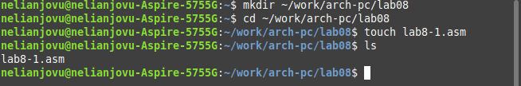{#fig:001 width=70%}

При реализации циклов в NASM с помощью инструкции цикла важно помнить, что эта инструкция использует регистр ecx в качестве счетчика и уменьшает его значение на единицу на каждом шаге. Теперь я открою созданный мной файл, затем скопирую и изучу текст данной программы(рис 2)

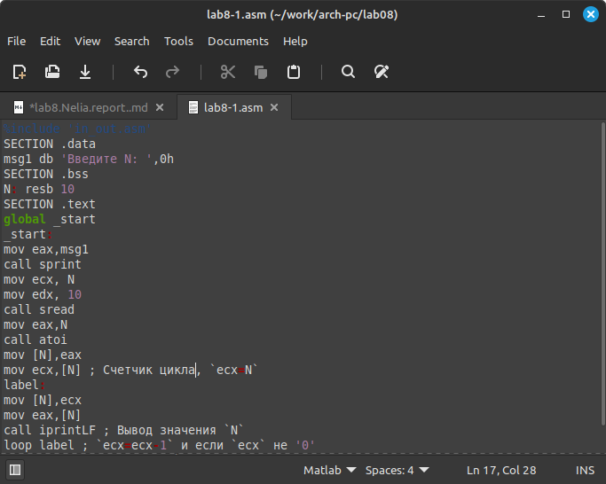{#fig:001 width=70%}

Теперь я создам исполняемый файл и запущу его(рис 3)

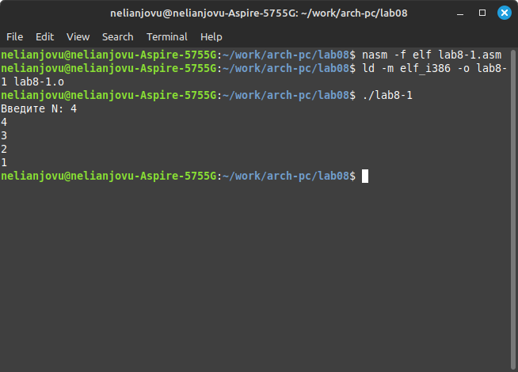{#fig:001 width=70%}

Я изменю текст программы, меняя в цикле значение регистра ecx(рис 4)

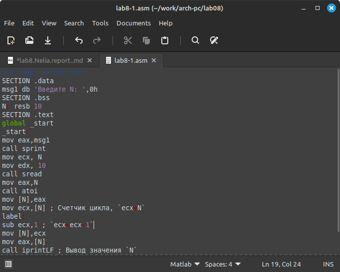{#fig:001 width=70%}

Я создам исполняемый файл и проверю его работу(рис 5)

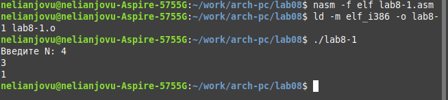{#fig:001 width=70%}

*Когда я запускаю программу, она отображает значения 3 и 1, количество циклов не соответствует значению n*

Чтобы использовать регистр ecx в цикле и обеспечить правильную работу программы, мне нужно использовать стек. Поэтому я внесу изменения в текст программы, добавив команды push и pop (добавление в стек и извлечение из стека), чтобы сохранить значение счетчика цикла(рис 6)

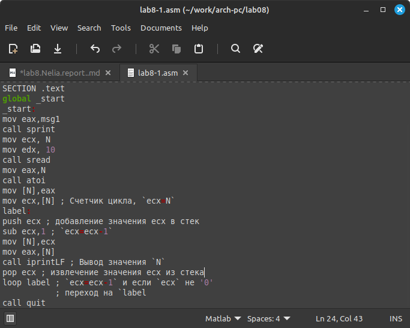{#fig:001 width=70%}

Я создам исполняемый файл и проверю его работу(рис 7)

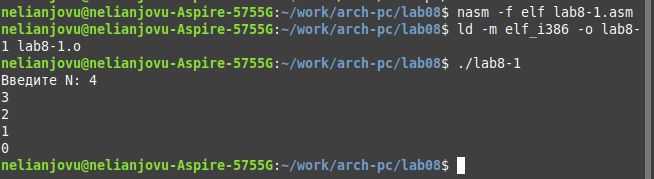{#fig:001 width=70%}

*В этом случае количество проходов цикла соответствует значению N, введенному с клавиатуры*

**2. Обработка аргументов командной строки**

Я создам файл lab8-2.asm с помощью команды touch(рис 8)

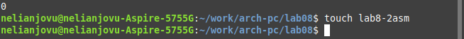{#fig:001 width=70%}

Когда вы запускаете программу, аргументы располагаются в стеке, поэтому, чтобы использовать аргументы в программе, их просто нужно извлечь из стека. Аргументы должны обрабатываться в цикле. Сначала вам нужно извлечь количество аргументов из стека, а затем просмотреть логику программы для каждого аргумента. Чтобы показать это, я скопирую данную программу в файл, который я только что создал(рис 9)

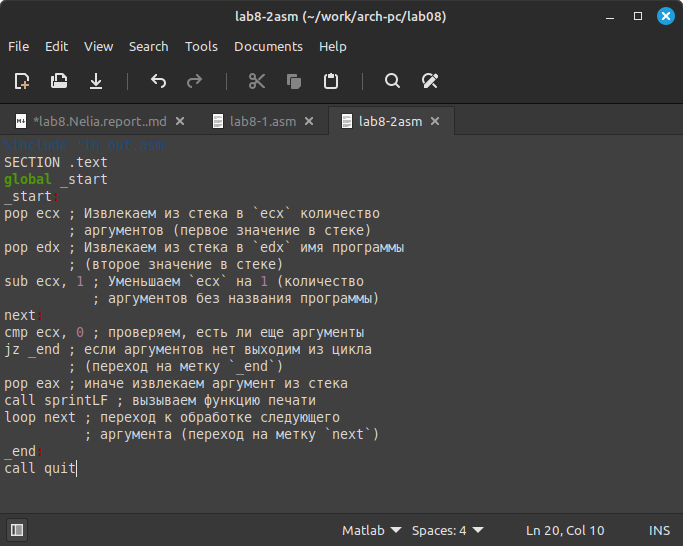{#fig:001 width=70%}

Я создам исполняемый файл и проверю его работу(рис 10)

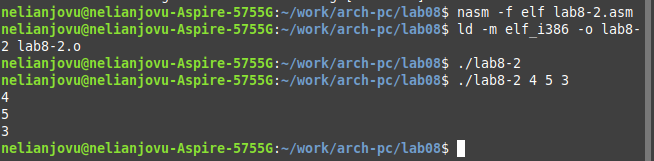{#fig:001 width=70%}

*Я ввела три аргумента, и программа обработала количество введенных мной аргументов.*

Я создам файл lab8-2.asm с помощью команды touch(рис 11)

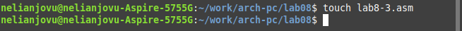{#fig:001 width=70%}

Я открою его и скопирую в него заданную программу, программа отображает сумму чисел, которые передаются программе в качестве аргументов(рис 12)

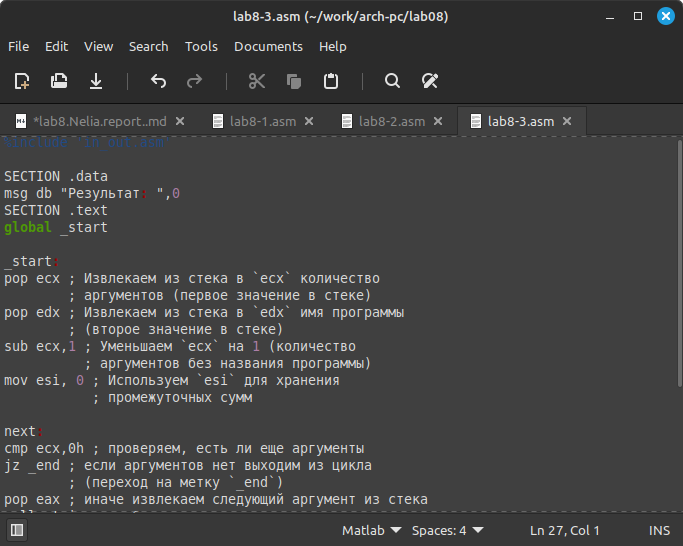{#fig:001 width=70%}

Я создам исполняемый файл и проверю его работу(рис 13)

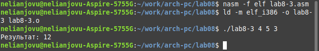{#fig:001 width=70%}

Я изменю программу так, чтобы она вычисляла произведение аргументов командной строки(рис 14)

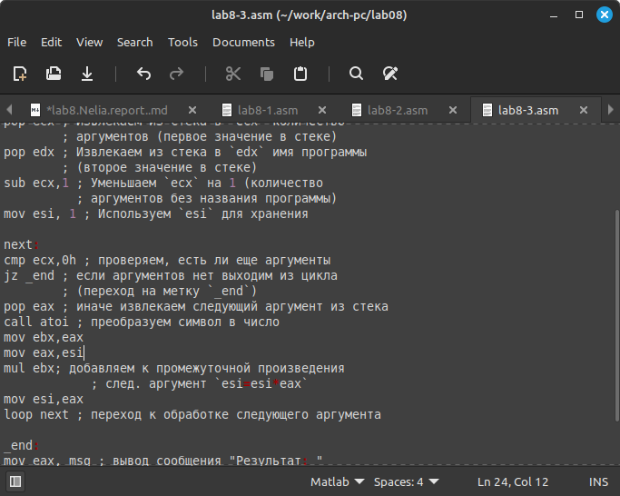{#fig:001 width=70%}

Я создам исполняемый файл и проверю его работу(рис 15)

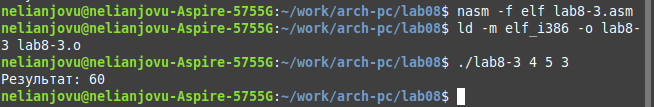{#fig:001 width=70%}

**3. Задание для самостоятельной работы**

Я создам файл lab8-4.asm с помощью команды touch(рис 16)

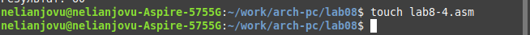{#fig:001 width=70%}

В созданном мной файле я напишу программу, которая находит сумму значений функции f(x) для x = x1, x2,x3.... и т. д. Программа должна вывести значение f(x1) + f(x2) + ... + f(xn). Значения x передаются в качестве аргументов. Тип функции f(x) я выберу из данной таблицы вариантов задания в соответствии с вариантом, полученным мной в ходе лабораторной работы 6.Мой вариант — вариант 14;f(x) = 7(x + 1)(рис 17)

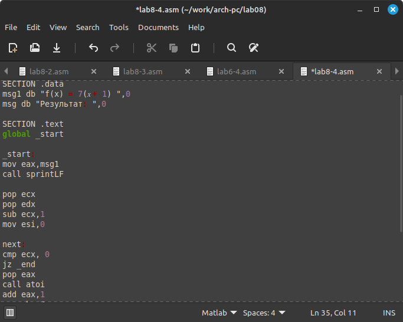{#fig:001 width=70%}

Я создам исполняемый файл и проверю его работу(рис 18)

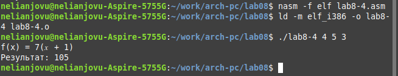{#fig:001 width=70%}

*Текстовая программа для самостоятельной работы*

``` 
%include 'in_out.asm'
SECTION .data
msg1 db "f(x) = 7(𝑥 + 1) ",0
msg db "Результат: ",0
SECTION .text
global _start
_start:
mov eax,msg1
call sprintLF
pop ecx 
pop edx
sub ecx,1
mov esi,0
next:
cmp ecx, 0 
jz _end 
pop eax 
call atoi
add eax,1
mov ebx,7
mul ebx
add esi,eax
loop next 
_end:
mov eax, msg 
call sprint
mov eax, esi 
call iprintLF
call quit 
```
# Выводы

Выполняя эту лабораторную работу, я приобрел навыки написания программ с использованием циклов и обработки аргументов командной строки.


# Список литературы{.unnumbered}

Архитектура ЭВМ

