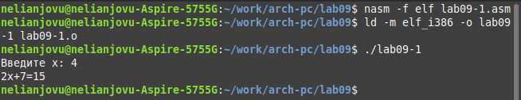
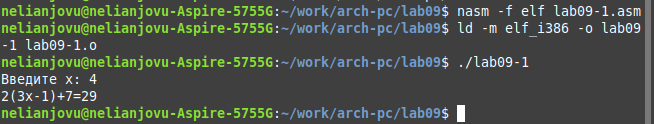
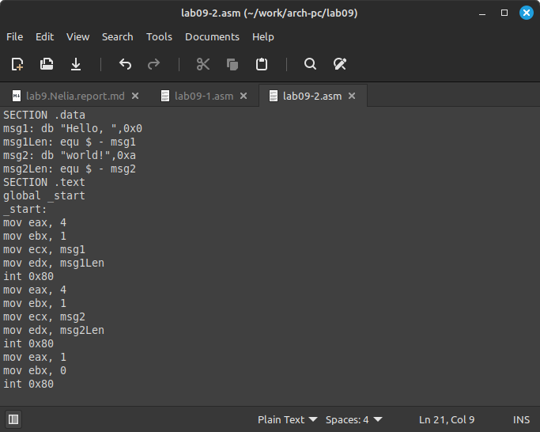
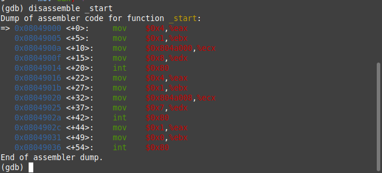

---
## Front matter
title: "Отчет по лабораторной работе No.9"
subtitle: "Дисциплины: Архитектура компьютера"
author: "Нджову Нелиа"

## Generic otions
lang: ru-RU
toc-title: "Содержание"

## Bibliography
bibliography: bib/cite.bib
csl: pandoc/csl/gost-r-7-0-5-2008-numeric.csl

## Pdf output format
toc: true # Table of contents
toc-depth: 2
lof: true # List of figures
lot: true # List of tables
fontsize: 12pt
linestretch: 1.5
papersize: a4
documentclass: scrreprt
## I18n polyglossia
polyglossia-lang:
  name: russian
  options:
	- spelling=modern
	- babelshorthands=true
polyglossia-otherlangs:
  name: english
## I18n babel
babel-lang: russian
babel-otherlangs: english
## Fonts
mainfont: PT Serif
romanfont: PT Serif
sansfont: PT Sans
monofont: PT Mono
mainfontoptions: Ligatures=TeX
romanfontoptions: Ligatures=TeX
sansfontoptions: Ligatures=TeX,Scale=MatchLowercase
monofontoptions: Scale=MatchLowercase,Scale=0.9
## Biblatex
biblatex: true
biblio-style: "gost-numeric"
biblatexoptions:
  - parentracker=true
  - backend=biber
  - hyperref=auto
  - language=auto
  - autolang=other*
  - citestyle=gost-numeric
## Pandoc-crossref LaTeX customization
figureTitle: "Рис."
tableTitle: "Таблица"
listingTitle: "Листинг"
lofTitle: "Список иллюстраций"
lotTitle: "Список таблиц"
lolTitle: "Листинги"
## Misc options
indent: true
header-includes:
  - \usepackage{indentfirst}
  - \usepackage{float} # keep figures where there are in the text
  - \floatplacement{figure}{H} # keep figures where there are in the text
---

# Цель работы

Цель лабораторной работы – приобретение навыков написания программ с использованием подпрограмм. Введение в методы отладки с использованием GDB и его основные возможности.

# Задание

1. Реализация подпрограмм в NASM

2. Отладка программам с помощью GDB

3. Задание для самостоятельной работы

# Выполнение лабораторной работы

**1. Реализация подпрограмм в NASM**

Я создам каталог для lab09, зайду в него и создам файл lab09-1.asm(рис 1)

{#fig:001 width=70%}

Рассмотрим программу вычисления арифметического выражения f(x) = 2x + 7 с помощью подпрограммы _calcul. В этом примере x вводится с клавиатуры, а само выражение вычисляется в подпрограмме. Я скопирую текст программы ниже и скопирую его в созданный мной файл(рис 2)

{#fig:001 width=70%}

Я создам исполняемый файл и проверю его работу(рис 3)

{#fig:001 width=70%}

Я отредактирую программу так, чтобы она решала функцию f(g(x)), где f(x)=2x+7 и g(x)=3x-1(рис 4)

{#fig:001 width=70%}

Я создам исполняемый файл и проверю его работу(рис 5)

{#fig:001 width=70%}

**2. Отладка программам с помощью GDB**

Я создам новый файл lab09-2asm и скопирую в него данную программу(рис 6)

{#fig:001 width=70%}

Я создам исполняемый файл и запущу его с помощью отладчика GDB. Чтобы работать с GDB, мне нужно добавить в исполняемый файл отладочную информацию; для этого программы необходимо переводить с ключом «-g»(рис 7)

{#fig:001 width=70%}

Я протестирую программу, запустив ее в оболочке GDB с помощью команды запуска(рис 8)

{#fig:001 width=70%}

Для более детального анализа программы я поставлю точку останова на метку _start, с которой начинается выполнение любой ассемблерной программы, и запущу ее(рис 9)

{#fig:001 width=70%}

Я буду просматривать дизассемблированный код программы с помощью команды дизассемблирования, начиная с метки _start(рис 10)

{#fig:001 width=70%}

Я переключусь на отображение команд с синтаксисом Intel, введя команду set disassembly-flavor intel(рис 11)

{#fig:001 width=70%}

Для более удобного анализа программы включу режим псевдографики(рис 12)

{#fig:001 width=70%}

*В Intel все начинается с адреса, затем с источника, а в ATT наоборот*

**2.1. Добавление точек останова**

На предыдущих шагах точка останова была установлена ​​по имени метки (_start). Я проверю это с помощью команды info Breakpoints (сокращенно i b)(рис 13)

{#fig:001 width=70%}

Я поставлю еще одну точку останова по адресу инструкции(рис 14)

{#fig:001 width=70%}

Теперь я посмотрю информацию обо всех установленных точках останова.

{#fig:001 width=70%}

**2.2. Работа с данными программы в GDB**

Я выполню 5 инструкций с помощью команды Stepi (или Si)(рис 16)

{#fig:001 width=70%}

*Значения eax,ecx,esp и edx изменились*

Содержимое регистров также можно просмотреть с помощью команды info Registers(рис 17)

{#fig:001 width=70%}

С помощью команды x &<имя переменной>  можно посмотреть содержимое переменной.Я поищу значение переменной msg1 по имени(рис 18)

{#fig:001 width=70%}

Теперь я посмотрю на значение переменной msg2 по адресу. Адрес переменной можно определить из дизассемблированной инструкции(рис 19)

{#fig:001 width=70%}

Вы можете изменить значение регистра или ячейки памяти с помощью команды set, передав ей имя или адрес регистра в качестве аргумента. Я изменю первый символ переменной msg1(рис 20)

{#fig:001 width=70%}

Теперь я заменю символ во второй переменной msg2(рис 21)

{#fig:001 width=70%}

Я буду использовать команду set для изменения значения регистра ebx(рис 22)

{#fig:001 width=70%}

**2.3. Обработка аргументов командной строки в GDB**

Я скопирую файл lab8-2.asm, созданный во время лабораторной работы 8, с помощью программы, которая печатает аргументы командной строки, в файл с именем lab09-3.asm(рис 23)

{#fig:001 width=70%}

Я создам исполняемый файл и загрузим исполняемый файл в отладчик с аргументами, для загрузки программ с аргументами в gdb я буду использовать ключ --args(рис 24)

{#fig:001 width=70%}

Сначала я установлю точку останова перед первой инструкцией в программе и запущу ее(рис 25)

{#fig:001 width=70%}

Адрес вершины стека хранится в регистре esp и по этому адресу можно увидеть число, равное количеству аргументов командной строки (включая имя программы)(рис 26)

{#fig:001 width=70%}

*Как видите, количество аргументов равно 4 — это название программы lab09-3 и сами аргументы: аргумент1, аргумент 2 и 'аргумент 3'*

Я взгляну на оставшиеся позиции стека — адрес [esp+4] хранит адрес в памяти, где находится имя программы, адрес [esp+8] хранит адрес первого аргумента, адрес [esp+12] ] сохраняет второй аргумент и т. д(рис 27)

{#fig:001 width=70%}

*В 32-битных компьютерах информация хранится именно так: первая память выделяется 4 бита, а вторая — 4х2*

**3. Задание для самостоятельной работы**

1. Я создам новый файл с именем lab09-4.asm(рис 28)

{#fig:001 width=70%}

Используя функцию (f(x) = 7(x+1)) которая была у меня при выполнении lab08- задание 1, я напишу программу, которая вычисляет значение функции как подпрограмму(рис 29)

{#fig:001 width=70%}

Я создам исполняемый файл и запущу его(рис 30)

{#fig:001 width=70%}

2. Я создам новый файл с именем lab09-5.asm(рис 31)

{#fig:001 width=70%}

Я скопирую данную программу, которая вычисляет значение (3+2)*4+5(рис 32)

{#fig:001 width=70%}

Я создам исполняемый файл и запущу его с помощью GDB(рис 33)

{#fig:001 width=70%}

Теперь я проверю, где ошибка: первый шаг нашей программы — сложить ebx, равный 3, и eax, равный 2, что делает ebx=5, затем она перемещает 4 в ecx и по умолчанию умножает ecx на eax. что дает eax 8. В-третьих, он добавит ebx к ebx, в результате чего получится 10(рис 34).

{#fig:001 width=70%}

Я изменю программу так, чтобы она давала мне правильный ответ(рис 35)

{#fig:001 width=70%}

Теперь я создам исполняемый файл и запущу его(рис 36)

{#fig:001 width=70%}

*Текстовая программа для самостоятельной работы 1*
```
%include 'in_out.asm'

SECTION .data
msg: DB 'Введите x: ',0
result: db "f(x) = 7(x + 1) = ",0

SECTION .bss
x: RESB 80
res: RESB 80

SECTION .text
global _start

_start:
mov eax, msg
call sprint
mov ecx, x
mov edx, 80
call sread
mov eax,x
call atoi
call _calcul 
mov eax,result
call sprint
mov eax,[res]
call iprintLF
call quit

_calcul:
add eax,1
mov ebx,7
mul ebx
mov [res],eax
ret 

```
*Текстовая программа для самостоятельной работы 2*

``` 
%include 'in_out.asm'

SECTION .data
div: DB 'Результат: ',0

SECTION .text
GLOBAL _start
_start:

mov ebx,3
mov eax,2
add eax,ebx
mov ecx,4
mul ecx
add eax,5
mov edi,eax

mov eax,div
call sprint
mov eax,edi
call iprintLF

call quit

```


# Выводы

В ходе лабораторной работы я приобрел навыки написания программ с использованием подпрограмм. А также введение в методы отладки с использованием GDB и его основные возможности.


# Список литературы{.unnumbered}

Архитектура ЭВМ


