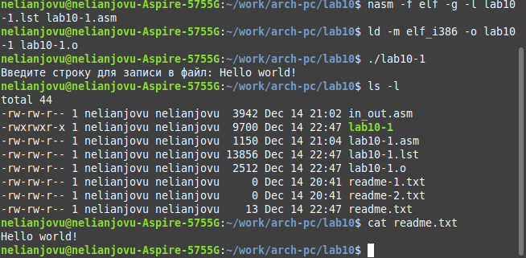
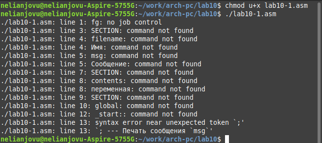
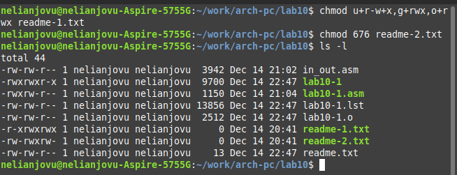

---
## Front matter
title: "Отчет по лабораторной работе No.10"
subtitle: "Дисциплины: Архитектура компьютера"
author: "Нджову Нелиа"

## Generic otions
lang: ru-RU
toc-title: "Содержание"

## Bibliography
bibliography: bib/cite.bib
csl: pandoc/csl/gost-r-7-0-5-2008-numeric.csl

## Pdf output format
toc: true # Table of contents
toc-depth: 2
lof: true # List of figures
lot: true # List of tables
fontsize: 12pt
linestretch: 1.5
papersize: a4
documentclass: scrreprt
## I18n polyglossia
polyglossia-lang:
  name: russian
  options:
	- spelling=modern
	- babelshorthands=true
polyglossia-otherlangs:
  name: english
## I18n babel
babel-lang: russian
babel-otherlangs: english
## Fonts
mainfont: PT Serif
romanfont: PT Serif
sansfont: PT Sans
monofont: PT Mono
mainfontoptions: Ligatures=TeX
romanfontoptions: Ligatures=TeX
sansfontoptions: Ligatures=TeX,Scale=MatchLowercase
monofontoptions: Scale=MatchLowercase,Scale=0.9
## Biblatex
biblatex: true
biblio-style: "gost-numeric"
biblatexoptions:
  - parentracker=true
  - backend=biber
  - hyperref=auto
  - language=auto
  - autolang=other*
  - citestyle=gost-numeric
## Pandoc-crossref LaTeX customization
figureTitle: "Рис."
tableTitle: "Таблица"
listingTitle: "Листинг"
lofTitle: "Список иллюстраций"
lotTitle: "Список таблиц"
lolTitle: "Листинги"
## Misc options
indent: true
header-includes:
  - \usepackage{indentfirst}
  - \usepackage{float} # keep figures where there are in the text
  - \floatplacement{figure}{H} # keep figures where there are in the text
---

# Цель работы

Цель данной лабораторной работы – помочь мне приобрести навыки написания программ для работы с файлами.

# Задание

1. Порядок выполнения лабораторной работы

2. Задание для самостоятельной работы

# Выполнение лабораторной работы

**1. Порядок выполнения лабораторной работы**

1. Я создам каталог для программ лабораторных работ 10, зайду в него и создам файлы lab10-1.asm, readme-1.txt и readme-2.txt(рис 1)

{#fig:001 width=70%}

2. Я открою и введу данную текстовую программу в файл lab10-1.asm(рис 2)

{#fig:001 width=70%}

Я создам исполняемый файл и проверю его работу(рис 3)

{#fig:001 width=70%}

3. Я буду использовать команду chmod, чтобы изменить разрешения исполняемого файла lab10-1, чтобы предотвратить его выполнение(рис 4)

{#fig:001 width=70%}

После изменения разрешений я попыталася выполнить его, и он сказал «Permission denied», что означает, что я не могу его выполнить, потому что у меня нет на это разрешения.

4. Теперь с помощью команды chmod изменю права доступа к файлу lab10-1.asm с исходным кодом программы, добавив права на выполнение(рис 5)

{#fig:001 width=70%}

При запуске файла он читает слова, которые не являются командами, как ошибки.

5. По моему варианту я дам права доступа к файлу readme-1.txt в символьном виде (r-x rwx rwx), а к файлу readme-2.txt в бинарном виде (110 111 110)Корректность выполнения проверю с помощью команды ls -l(рис 6)

{#fig:001 width=70%}

**2. Задание для самостоятельной работы**

Я создам файл lab10-2.asm(рис 7)

{#fig:001 width=70%}

Я напишу программу в созданном мной файле, которая будет следовать заданному алгоритму(рис 8)

{#fig:001 width=70%}

Я создам исполняемый файл и протестирую его работу, также проверю наличие файла и его содержимое с помощью команд ls и cat(рис 9)

{#fig:001 width=70%}

*Текстовая программа для самостоятельной работы*


``` 
%include 'in_out.asm'

SECTION .data
msg: db 'Как Вас зовут? ', 0
filename: db 'name.txt', 0
msg1: db 'Меня зовут '
thelength: equ $-msg1

section .bss
name: resb 64

section .text
global _start

_start:
mov eax, msg
call sprint

mov ecx, name
mov edx,64
call sread

mov ecx, 0777o
mov ebx, filename
mov eax, 8
int 80h

mov ecx, 2
mov ebx, filename
mov eax, 5
int 80h

mov eax, 4
mov ebx,eax
mov ecx, msg1
mov edx, 22
int 80h

mov eax,4
mov ebx,eax
mov ecx,name
mov edx, 64
int 80h


mov ebx, esi
mov eax, 6
int 80h
call quit
```

# Выводы

В ходе лабораторной работы я приобрел навыки написания программ для работы с файлами.

# Список литературы{.unnumbered}

Архитектура ЭВМ
